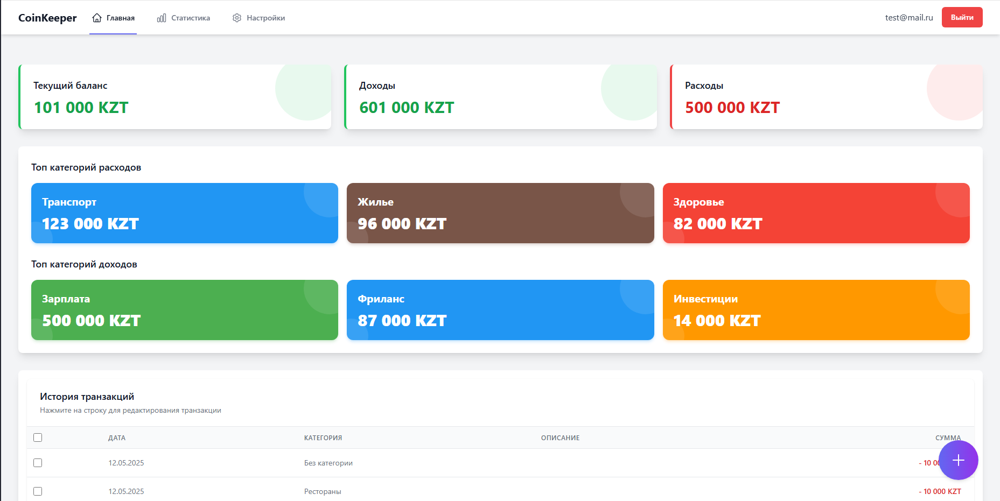

# Coin - Приложение для учета финансов

Это приложение для отслеживания доходов и расходов, созданное на React с использованием Vite.

## Скриншоты

<div align="center">
  
  <p>Управление категориями</p>
  
  
  <p>Статистика доходов и расходов</p>
  
  
  <p>Авторизация пользователя</p>
  
  
  <p>Регистрация нового пользователя</p>
  
  
  <p>Главная страница с обзором финансов</p>
</div>

## Функциональность

- Отслеживание доходов и расходов
- Организация транзакций по категориям
- Создание и редактирование категорий
- Просмотр статистики
- Авторизация и аутентификация пользователя

## Технологии

- React 19
- Vite
- Redux Toolkit
- React Router
- Tailwind CSS
- Axios
- localStorage для хранения данных

## Установка и запуск

1. Клонируйте репозиторий:
```bash
git clone https://github.com/your-username/coin.git
cd coin
```

2. Установите зависимости:
```bash
npm install
```

3. Создайте файл `.env` в корневом каталоге проекта и установите необходимые переменные окружения:
```
REACT_APP_API_URL=https://your-api-url-here.com/api
```

4. Запустите приложение в режиме разработки:
```bash
npm run dev
```

5. Для сборки проекта:
```bash
npm run build
```

## Локальное хранение данных

По умолчанию приложение использует localStorage для хранения данных пользователя. Данные пользователя хранятся локально в браузере и не отправляются на внешний сервер.

## Лицензия

MIT
